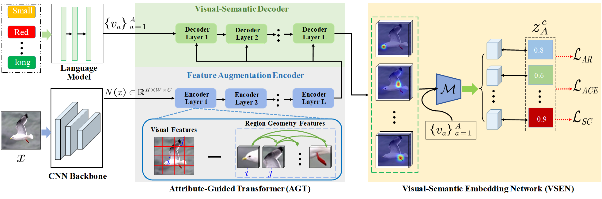

# TransZero [[arXiv]](https://arxiv.org/pdf/2112.01683.pdf)


This repository contains the training and [testing](https://github.com/shiming-chen/TransZero/tree/test) code for the paper  "***TransZero: Attribute-guided Transformer for Zero-Shot Learning***" accepted to AAAI 2022. 




## Running Environment
The implementation of **TransZero** is mainly based on Python 3.8.8 and [PyTorch](https://pytorch.org/) 1.8.0. To install all required dependencies:
```
$ pip install -r requirements.txt
```

Additionally, we use [Weights & Biases](https://wandb.ai/site) (W&B) to keep track and organize the results of experiments. You may need to follow the [online documentation](https://docs.wandb.ai/quickstart) of W&B to quickstart. To run these codes, [sign up](https://app.wandb.ai/login?signup=true) an online account to track experiments or create a [local wandb server](https://hub.docker.com/r/wandb/local) using docker (recommended).


## Download Dataset 

We trained the model on three popular ZSL benchmarks: [CUB](http://www.vision.caltech.edu/visipedia/CUB-200-2011.html), [SUN](http://cs.brown.edu/~gmpatter/sunattributes.html) and [AWA2](http://cvml.ist.ac.at/AwA2/) following the data split of [xlsa17](http://datasets.d2.mpi-inf.mpg.de/xian/xlsa17.zip). In order to train the **TransZero**, you should firstly download these datasets as well as the xlsa17. Then decompress and organize them as follows: 
```
.
├── data
│   ├── CUB/CUB_200_2011/...
│   ├── SUN/images/...
│   ├── AWA2/Animals_with_Attributes2/...
│   └── xlsa17/data/...
└── ···
```


## Visual Features Preprocessing

In this step, you should run the following commands to extract the visual features of three datasets:

```
$ python preprocessing.py --dataset CUB --compression --device cuda:0
$ python preprocessing.py --dataset SUN --compression --device cuda:0
$ python preprocessing.py --dataset AWA2 --compression --device cuda:0
```

## Training TransZero from Scratch
In `./wandb_config`, we provide our parameters setting of conventional ZSL (CZSL) and generalized ZSL (GZSL) tasks for CUB, SUN, and AWA2. You can run the following commands to train the **TransZero** from scratch:

```
$ python train_cub.py   # CUB
$ python train_sun.py   # SUN
$ python train_awa2.py  # AWA2
```
**Note**: Please load the corresponding setting when aiming at the CZSL task.

## Results

We also provide trained models ([Google Drive](https://drive.google.com/drive/folders/1WK9pm2eX2Rl4rWqXqe_EZiAM8wWB8yqG?usp=sharing)) on three datasets. You can download these `.pth` files and validate the results in our paper. Please refer to the [test branch](https://github.com/shiming-chen/TransZero/tree/test) for testing codes and usage.
Following table shows the results of our released models using various evaluation protocols on three datasets, both in the CZSL and GZSL settings:

| Dataset | Acc(CZSL) | U(GZSL) | S(GZSL) | H(GZSL) |
| :-----: | :-----: | :-----: | :-----: | :-----: |
| CUB | 76.8 | 69.3 | 68.3 | 68.8 |
| SUN | 65.6 | 52.6 | 33.4 | 40.8 |
| AWA2 | 70.1 | 61.3 | 82.3 | 70.2 |

**Note**:  The training of our models and all of the above results are run on a server with an AMD Ryzen 7 5800X CPU, 128GB memory, and an NVIDIA RTX A6000 GPU (48GB).

## Citation
If this work is helpful for you, please cite our paper.

```
@InProceedings{Chen2022TransZero,
    author    = {Chen, Shiming and Hong, Ziming and Liu, Yang and Xie, Guo-Sen and Sun, Baigui and Li, Hao and Peng, Qinmu and Lu, Ke and You, Xinge},
    title     = {TransZero: Attribute-guided Transformer for Zero-Shot Learning},
    booktitle = {Proceedings of the Thirty-Sixth AAAI Conference on Artificial Intelligence (AAAI)},
    year      = {2022}
}
```

## References
Parts of our codes based on:
* [hbdat/cvpr20_DAZLE](https://github.com/hbdat/cvpr20_DAZLE)
* [zhangxuying1004/RSTNet](https://github.com/zhangxuying1004/RSTNet)

## Contact
If you have any questions about codes, please don't hesitate to contact us by gchenshiming@gmail.com or hoongzm@gmail.com.
